# 🚀 Awesome Product Experience Analytics

  
  
  
  
  

## 📌 Comprehensive Product Experience Analytics Ecosystem

**Curated Benchmark & Catalog of SaaS Platforms and Open-Source GitHub Projects**

*Focused on Product Analytics, Session Replay, Feature Adoption, Conversion Funnels, Cohort Retention & Digital Experience Insights.*

> 💡 **Welcome to the definitive guide on Product Experience Analytics!** Whether you're a Product Manager, Growth Engineer, or Data Analyst, this repository tracks category leaders and self-hostable open-source solutions for understanding user behavior, optimizing retention, and eliminating UX friction points.

---

## 📑 Table of Contents

- [📊 Sector Market Overview](#-sector-market-overview)
- [🏢 SaaS & Hosted Commercial Platforms](#-saas--hosted-commercial-platforms)
- [🔓 Open-Source GitHub Repositories](#-open-source-github-repositories)
- [⚡ Tech Architecture & Recommendations](#-tech-architecture--recommendations)
- [🤝 How to Contribute](#-how-to-contribute)
- [💖 Support & Community](#-support--community)
- [📈 Star History](#-star-history)
- [⚖️ Disclaimer & Privacy](#️-disclaimer--privacy)

---

## 📊 Sector Market Overview

> 🌐 **Market Size & Structure**: The global Product Analytics & Digital Experience Intelligence market is estimated at **$15.2 Billion in 2026** (growing at ~16.5% CAGR). The sector is **moderately fragmented**, with high-value enterprise leaders (*Contentsquare, Amplitude, Pendo*) coexisting alongside rapid-growth self-serve and open-source disruptors (*PostHog, Mixpanel, Umami*).

---

## 🏢 SaaS & Hosted Commercial Platforms

Below is a comparative breakdown of top commercial Product Experience Analytics platforms, sorted by **Company Valuation / Scale (Descending)**:

| 🏢 Product Platform | 📝 Description | 💵 Starting Pricing | 🎁 Free Tier / Trial Limit | 📊 Company Valuation / Scale |
| :--- | :--- | :--- | :--- | :--- |
| **[Contentsquare](https://contentsquare.com/)** | Enterprise digital experience analytics platform providing journey analysis, zonal heatmaps, session replay, and AI friction detection. | **$99/month** *(Scale Plan starting baseline)* | **14-day free trial** *(up to 5,000 sessions)* | **~$5.6B Valuation** / $300M+ ARR / 1,800+ employees |
| **[Pendo](https://www.pendo.io/)** | Comprehensive product experience suite combining behavioral analytics, in-app guides, NPS feedback, and visual roadmapping. | **$7,000/year** *(~$583/mo starting tier)* | **Free forever plan** *(up to 500 Monthly Active Users)* | **~$2.6B Valuation** / $150M+ ARR / 900+ employees |
| **[FullStory](https://www.fullstory.com/)** | Digital experience and high-definition session replay platform focusing on rage clicks, dead clicks, and funnel friction playback. | **$299/month** *(Business Plan starting baseline)* | **14-day free trial** *(5,000 sessions)*, converts to **1,000 sessions/mo free** | **~$1.8B Valuation** / $100M+ ARR / 500+ employees |
| **[Amplitude](https://amplitude.com/)** | Behavioral product analytics platform powering deep cohort retention, path analysis, conversion funnels, and feature experimentation. | **$49/month** *(Plus Plan starting baseline)* | **Free forever plan** *(50,000 MTUs & 10M events/month)* | **~$1.1B Market Cap** *(NASDAQ: AMPL)* / $300M ARR |
| **[Mixpanel](https://mixpanel.com/)** | Self-serve event-based analytics platform featuring interactive funnel reports, user flows, and real-time product dashboarding. | **$20/month** *(Growth Plan starting baseline)* | **Free forever plan** *(up to 20,000,000 events/month)* | **~$1.05B Valuation** / $100M+ ARR / 400+ employees |
| **[Quantum Metric](https://www.quantummetric.com/)** | Continuous product design & session analytics platform capturing real-time user friction, API errors, and financial impact. | **$1,500/month** *(~$18,000/yr Enterprise tier)* | **14-day free trial** *(capped at 10,000 recorded sessions)* | **~$1.0B Valuation** *(Unicorn)* / $80M ARR |
| **[Heap](https://www.heap.io/)** *(Contentsquare)* | Autocapture product analytics platform that records every web & app interaction automatically for retroactive funnel evaluation. | **$300/month** *($3,600/yr Growth tier)* | **Free forever plan** *(up to 10,000 sessions/month)* | **~$960M Valuation** *(Acquired)* / 300+ employees |
| **[PostHog (Cloud)](https://posthog.com/)** | Developer-first product platform integrating event tracking, session recording, feature flags, A/B experiments, and user surveys. | **$0.00031/event** *(Pay-as-you-go above free tier)* | **Free forever plan** *(1,000,000 events & 5,000 replays/month)* | **~$250M Valuation** *(Series B)* / 50+ employees |
| **[Glassbox](https://www.glassbox.com/)** | Enterprise digital customer experience analytics providing web/mobile session replay, journey mapping, and funnel optimization. | **$1,000/month** *(~$12,000/yr starting tier)* | **14-day free trial** *(up to 2,500 recorded sessions)* | **~$150M Valuation** *(Acquired)* / 300+ employees |
| **[UXCam](https://uxcam.com/)** | Specialized mobile app experience analytics platform delivering session playback, touch heatmaps, and funnel analytics for iOS & Android. | **$99/month** *(Growth Plan starting baseline)* | **Free forever plan** *(3,000 sessions/month, up to 100k total)* | **~$15M ARR** / 80+ employees |

---

## 🔓 Open-Source GitHub Repositories

Below are top open-source product and web analytics projects, sorted by **GitHub Star Count (Descending)**:

1. 🌟 **[PostHog](https://github.com/posthog/posthog)**   
   *Leading open-source product analytics suite. Offers event tracking, session replay, feature flags, A/B testing, surveys, and error tracking. Self-hostable via Docker/Kubernetes.*

2. 🌿 **[Umami](https://github.com/umami-software/umami)**   
   *Fast, privacy-focused, lightweight open-source analytics platform built with Node.js and Next.js. Great privacy-compliant alternative to Google Analytics.*

3. 🛡️ **[Matomo](https://github.com/matomo-org/matomo)**   
   *Mature open-source web and product analytics platform focused on 100% data ownership, custom reporting, heatmaps, and strict GDPR compliance.*

4. 🔒 **[Plausible Analytics](https://github.com/plausible/analytics)**   
   *Lightweight, open-source, cookie-free web and event analytics engine written in Elixir. Designed for privacy compliance out of the box.*

5. 📹 **[OpenReplay](https://github.com/openreplay/openreplay)**   
   *Self-hosted session replay and developer monitoring suite. Allows engineering teams to replay user sessions and inspect network logs/DevTools.*

6. ⚡ **[Highlight.io](https://github.com/highlight/highlight)**   
   *Full-stack open-source application monitoring suite integrating session replay, error monitoring, performance metrics, and log management.*

7. 🎛️ **[OpenPanel](https://github.com/OpenPanel-dev/openpanel)**   
   *Modern open-source product analytics platform designed as an open-source rival to Mixpanel and Amplitude with clean event visualization.*

8. 📱 **[Countly](https://github.com/Countly/countly-server)**   
   *Product analytics engine tailored for web, desktop, and mobile applications with built-in crash reporting, push notifications, and user profiling.*

9. 📊 **[June](https://github.com/juneHQ/june)**   
   *Open product analytics built on top of Segment and data warehouses, optimized for B2B SaaS companies practicing Product-Led Growth (PLG).*

10. 🕵️ **[Ackee](https://github.com/electerious/ackee)**   
    *Self-hosted Node.js analytics server created for privacy-conscious web developers seeking clean aggregate traffic insights.*

11. 🔍 **[HyperDX](https://github.com/hyperdxio/hyperdx)**   
    *Open-source developer observability and session replay platform powered by ClickHouse for ultra-fast query performance.*

---

## ⚡ Tech Architecture & Recommendations

When architecting a Product Experience Analytics stack, consider the following strategic blueprints:

* 🚀 **All-in-One Open Stack**: Deploy **PostHog** (self-hosted or cloud) for a single platform handling event analytics, session replay, feature flags, and A/B experiments.
* 📹 **Debugging & Session Replay**: Combine **OpenReplay** or **Highlight.io** with your existing database/warehouse for deep visual session inspection.
* 🔒 **Strict Data Governance & Privacy**: Choose **Matomo** or **Plausible** for zero-cookie web tracking and complete data residency.
* 🏢 **Enterprise Product-Led Growth**: Utilize **Amplitude** or **Mixpanel** for complex multi-cohort retention modeling, paired with **Contentsquare** or **FullStory** for high-volume session playback.

---

## 🤝 How to Contribute

We welcome community contributions! Follow these steps to submit additions or updates:

1. Fork the repository.
2. Add or update entries in `README.md` maintaining table/formatting conventions.
3. Provide factual descriptions, official website links, and accurate star/pricing metrics.
4. Submit a Pull Request detailing your changes.

Check out our [Awesome List standard guideline](https://github.com/ishandutta2007/Awesome-Awesome-Awesome) for quality guidelines.

---

## 💖 Support & Community

If you find this repository valuable for your product or engineering team, consider showing your support:

* ⭐ **Star this repository** to help others discover it!
* 🔀 **Fork and share** it with fellow product managers and developers.
* 💬 Join the discussion in our [Discord Community](https://discord.gg/jc4xtF58Ve).
* ☕ **Sponsor / Buy me a coffee**: If you'd like to support open-source maintenance, visit my [GitHub Sponsor Dashboard](https://github.com/sponsors/ishandutta2007).

---

## 📈 Star History

---

## ⚖️ Disclaimer & Privacy

- This is a community-curated benchmark — not an exhaustive endorsement of any platform.
- Product analytics tools process user behavioral data. Always enforce compliance with privacy standards (GDPR, CCPA, HIPAA), implement user consent banners, and ensure secure data handling. Self-hosted instances require active security maintenance.
